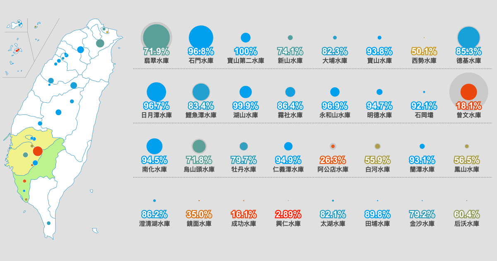

# 台灣水庫即時水情與歷史資料

2012-01-01 起全台重要水庫的歷年水情資料，並且與最新資料做比對，方便跟歷史紀錄對照水情狀況。

雖然已經有很多即時水情網站，但水庫蓄水量會隨季節變化，「65% 是多還是少」需要對照歷史紀錄才知道，並不能單純用絕對數字判斷，這是做這份資料呈現的主要發想。

圖表設計則是參考[天下雜誌的 2021 水情專題報導](https://www.cw.com.tw/graphics/drought-2023/)內的圖表，該專頁有時候會突然好幾個月沒更新，所以仿照他們做了類似的圖表。

圖表資料僅包含每月1日/8日/15日/22日，以及前一日的資料，避免圖表資料太過雜亂。

程式跑在 Google App Engine 上，會自動拉經濟部水利署的[水庫蓄水統計表](https://fhy.wra.gov.tw/ReservoirPage_2011/StorageCapacity.aspx)上的最新資料。

每小時會更新一次資料，也可以把網頁開著做為電子看板使用。
